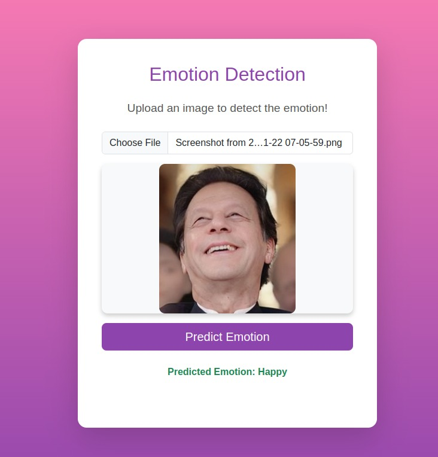
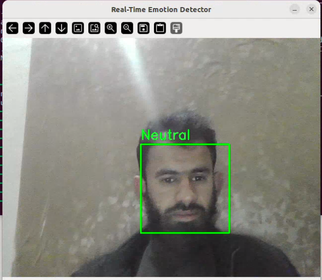

# **EmotionAI: Facial Emotion Detection System**

## **🚀 [Live Demo]**
The project is now live on Hugging Face Spaces! Try it out directly:

- **📸 [Image Upload Frontend](https://huggingface.co/spaces/MuhammadSheraza002/facial-emotion-detection-image)** (Original Design)
- **🎥 [Live Video Prediction](https://huggingface.co/spaces/MuhammadSheraza002/facial-emotion-detection-video)** (Premium Design)
- **⚙️ [Backend API](https://huggingface.co/spaces/MuhammadSheraza002/facial-emotion-detection-backend)** (FastAPI)

---

## **Demo Screenshots**

<p align="center">
  
  
</p>

---

## **Overview**
**Facial Emotion Detection System** is an open-source project designed to identify human emotions from images and real-time video streams using advanced Convolutional Neural Networks (CNNs). The project is modular, containerized using Docker, and made accessible for global use through Hugging Face Spaces.

---

## **Features**
1. **Backend**: A RESTful API built with **FastAPI** for image-based emotion detection.
2. **Frontend (Image)**: A static web interface for uploading images and viewing predictions (Original Design).
3. **Frontend (Video)**: A premium web interface for real-time webcam emotion detection.
4. **ResNet50V2**: Powered by a high-accuracy deep learning architecture.
5. **Dockerized**: Fully containerized for easy deployment.

---

## **Folder Structure**
```plaintext
Facial-Emotion-Detection-System/
├── backend/                      # Backend service (FastAPI)
│   ├── main.py                   # API implementation
│   ├── Dockerfile                # Deployment config
│   └── haarcascade_frontalface_default.xml
├── frontend/                     # Image Upload Frontend (Original)
│   ├── index.html
│   ├── styles.css
│   └── scripts.js
├── video_prediction/             # Video Prediction Frontend (Premium)
│   ├── index.html
│   ├── styles.css
│   └── scripts.js
├── Notebooks/                    # Training and Analysis
├── demo/                         # Visual assets
└── README.md                     # Project documentation
```

---

## **How to Use**

### **1. Use Live Version**
Simply visit the links in the **Live Demo** section above to try the application without any setup.

### **2. Local Setup**

#### **Clone the Repository**
```bash
git clone https://github.com/Muhammad-Sheraz-ds/Facial-Emotion-Detection-System.git
cd Facial-Emotion-Detection-System
```

#### **Backend Setup**
```bash
cd backend
pip install -r requirements.txt
uvicorn main:app --reload
```

#### **Frontend Setup**
Open `frontend/index.html` (for image upload) or `video_prediction/index.html` (for live video) in your modern web browser.

---

## **Model Weights**
The pretrained model weights are stored in the Docker image and deployed to Hugging Face Spaces. If running locally, ensure you have the `ResNet50_final_weights.weights.h5` file in the `backend/weights/` directory.

---

## **License**
This project is licensed under the MIT License.

---
Built by **Muhammad Sheraz**
